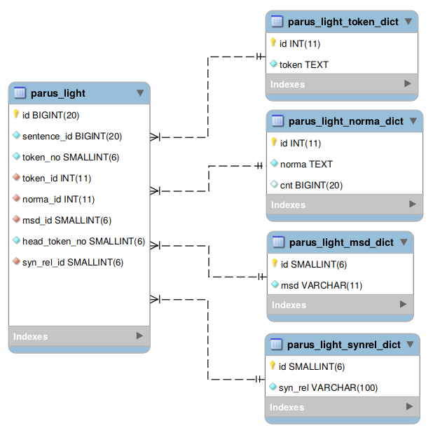

## Вводные замечания об устройстве корпуса
Корпус PaRuS представляет собой базу данных MySQL. Для работы с корпусом требуется установка СУБД и программного обеспечения для выполнения запросов. Мы рекомендуем [MySQL Community Edition](https://www.mysql.com/products/community) — свободно распространяемую версию СУБД MySQL (лицензия [GPL](https://ru.wikipedia.org/wiki/GNU_General_Public_License)). На сайте MySQL можно найти:
- актуальную версию самой СУБД — [MySQL Community Server](https://dev.mysql.com/downloads/mysql);
- оригинальное программное обеспечение для выполнения запросов — [MySQL Workbench](https://dev.mysql.com/downloads/workbench).

## Развёртывание корпуса PaRuS
#### Шаг 1. Создание базы данных в MySQL
Запустите MySQL Workbench, создайте подключение к СУБД и создайте базу данных (БД) с именем parus.

#### Шаг 2. Загрузка и распаковка
[Загрузите архив](./downloads.html), содержащий резервную копию БД PaRuS, и распакуйте его. В Linux это можно сделать командой `gzip -d имя_архива.gz`. В Windows воспользуйтесь подходящим архиватором, например, [7-zip](https://www.7-zip.org).

#### Шаг 3. Восстановление таблиц корпуса PaRuS из резервной копии
В Linux это удобнее сделать, воспользовавшись консольной утилитой mysql. Общий вид команды: `mysql -u USER -p DATABASE < /path/to/dump.sql` (процесс распаковки и восстановления из бэкапа можно совместить: `gunzip < /path/to/dump.sql.gz | mysql -u USER -p DATABASE`).  Здесь USER — имя пользователя СУБД (можно использовать имя администратора — root), DATABASE — имя созданной БД (parus, см. Шаг 1). Утилита запросит пароль пользователя СУБД.

Следует принимать во внимание, что процесс восстановления из резервной копии занимает длительное время.

## Структура таблиц
Корпус PaRuS хранится в виде пяти таблиц (см. EER-диаграмму ниже). Ведущая роль отведена таблице parus_light. Остальные таблицы представляют собой словари (токенов, нормальных форм, морфологических тегов и синтаксических отношений), на которые ссылается parus_light. Такая организация экономит дисковое пространство и сокращает время выполнения некоторых запросов.



## Примеры запросов
Для выполнения запросов запустите MySQL Workbench, подключитесь к СУБД и выберите БД parus в качестве «БД по умолчанию».

Для выборки данных корпуса PaRuS в формате CoNLL используйте следующий запрос:

```sql
select pl.id, pl.sentence_id, pl.token_no, plt.token, pln.norma, SUBSTR(plm.msd,1,1) as pos_1, SUBSTR(plm.msd,1,1) as pos_2, plm.msd, pl.head_token_no, plsr.syn_rel
from parus_light pl
    inner join parus_light_token_dict plt on pl.token_id = plt.id
    inner join parus_light_norma_dict pln on pl.norma_id = pln.id
    inner join parus_light_msd_dict plm on pl.msd_id = plm.id
    inner join parus_light_synrel_dict plsr on pl.syn_rel_id = plsr.id
order by pl.sentence_id, pl.token_no
;
```

Наличие индексов упрощает поиск предложений и словосочетаний, в которых употреблено определённое слово. Например, чтобы выбрать из корпуса только предложения, содержащие слово «хомячок», можно воспользоваться таким запросом:

```sql
select pl.id, pl.sentence_id, pl.token_no, plt.token, pln.norma, plm.msd, pl.head_token_no, plsr.syn_rel
from parus_light pl
  inner join parus_light_token_dict plt on pl.token_id = plt.id
  inner join parus_light_norma_dict pln on pl.norma_id = pln.id
  inner join parus_light_msd_dict plm on pl.msd_id = plm.id
  inner join parus_light_synrel_dict plsr on pl.syn_rel_id = plsr.id
  inner join 
  (
    select distinct plint.sentence_id
    from parus_light plint
      inner join parus_light_norma_dict plnint on plint.norma_id = plnint.id
    where plnint.norma = "хомячок"
  ) plx on plx.sentence_id = pl.sentence_id
order by pl.sentence_id, pl.token_no
;
```

В БД корпуса PaRuS индексы созданы для поиска по токенам и нормальным формам. Для ускорения поиска с использованием типов синтаксических отношений или морфологических атрибутов требуется построение индексов по соответствующим полям таблицы parus_light.
