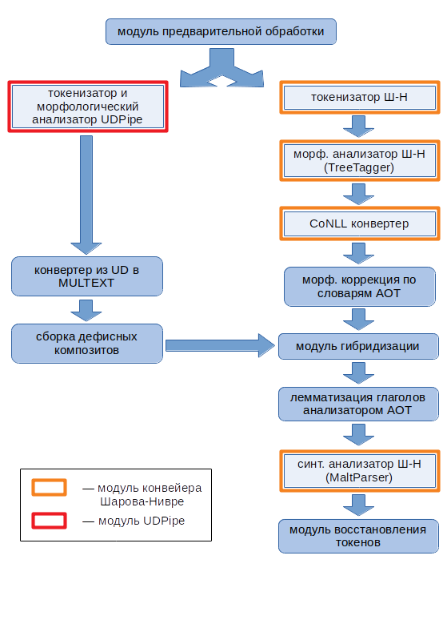

## Лингвистический конвейер PaRuS_pipe
Лингвистический конвейер PaRuS_pipe решает задачи:
- [определения границ слов](https://en.wikipedia.org/wiki/Text_segmentation#Word_segmentation) (или токенизации), 
- [определения границ предложений](https://en.wikipedia.org/wiki/Text_segmentation#Sentence_segmentation) (также известной как [SBD](https://en.wikipedia.org/wiki/Sentence_boundary_disambiguation)), 
- морфологического анализа,
- синтаксического анализа 
для текстов на русском языке.

PaRuS_pipe представляет собой гибрид конвейеров [Шарова-Нивре](http://corpus.leeds.ac.uk/mocky/) и [UDPipe](http://ufal.mff.cuni.cz/udpipe). Дополнительные модули устраняют ряд недостатков упомянутых конвейеров, которые были обнаружены на практике. Кроме того, для повышения качества [лемматизации](https://ru.wikipedia.org/wiki/Лемматизация) (т.е. определения нормальных форм слов) в PaRuS_pipe интегрирован словарный морфологический анализ на базе наработок проекта [АОТ](http://aot.ru/).

В нотационном отношении в PaRuS_pipe приняты следующие решения:
- в токенизации: дефисные композиты (*светло-серый*, *слуга-азиат*) представляются одним токеном (в UDPipe они дробятся на составляющие);
- в морфологическом анализе: используется нотация [MULTEXT-East (ru)](http://corpus.leeds.ac.uk/mocky/msd-ru.html) (как в конвейере Шарова-Нивре);
- в синтаксическом анализе: строится дерево зависимостей в [нотации СинТагРус](http://www.ruscorpora.ru/new/instruction-syntax.html#Синтаксическая) (как в конвейере Шарова-Нивре).

### Модульный состав и структура PaRuS_pipe
Структурная схема конвейера изображена на следующем рисунке.

Кратко охарактеризуем каждый из модулей.
