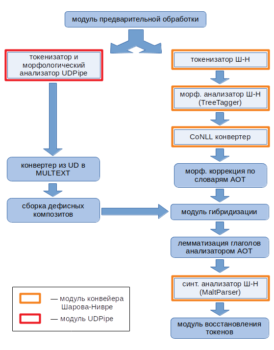
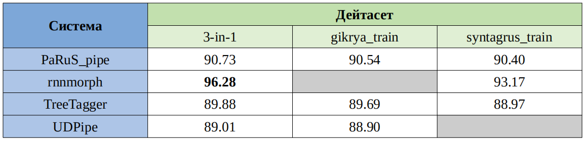
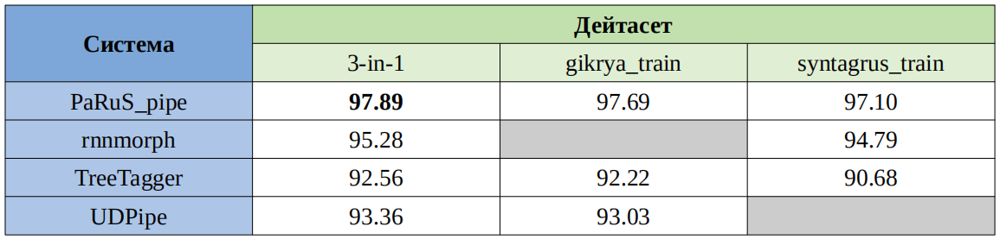
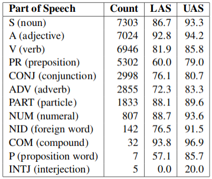

## Лингвистический конвейер PaRuS_pipe
Лингвистический конвейер PaRuS_pipe решает задачи:
- [определения границ слов](https://en.wikipedia.org/wiki/Text_segmentation#Word_segmentation) (или токенизации), 
- [определения границ предложений](https://en.wikipedia.org/wiki/Text_segmentation#Sentence_segmentation) (также известной как [SBD](https://en.wikipedia.org/wiki/Sentence_boundary_disambiguation)), 
- морфологического анализа,
- синтаксического анализа 
для текстов на русском языке.

PaRuS_pipe представляет собой гибрид конвейеров [Шарова-Нивре](http://corpus.leeds.ac.uk/mocky/) и [UDPipe](http://ufal.mff.cuni.cz/udpipe). Дополнительные модули устраняют ряд недостатков упомянутых конвейеров, которые были обнаружены на практике. Кроме того, для повышения качества [лемматизации](https://ru.wikipedia.org/wiki/Лемматизация) (т.е. определения нормальных форм слов) в PaRuS_pipe интегрирован словарный морфологический анализ на базе наработок проекта [АОТ](http://aot.ru/).

В нотационном отношении в PaRuS_pipe приняты следующие решения:
- в токенизации: дефисные композиты (*светло-серый*, *слуга-азиат*) представляются одним токеном (в UDPipe они дробятся на составляющие);
- в морфологическом анализе: используется нотация [MULTEXT-East (ru)](http://corpus.leeds.ac.uk/mocky/msd-ru.html) (как в конвейере Шарова-Нивре);
- в синтаксическом анализе: строится дерево зависимостей в [нотации СинТагРус](http://www.ruscorpora.ru/new/instruction-syntax.html#Синтаксическая) (как в конвейере Шарова-Нивре).

Демонстрационный образец PaRuS_pipe доступен в виде [docker-образа](https://hub.docker.com/r/parusproj/parus) (там же см. краткую инструкцию по использованию).

### Модульный состав и структура PaRuS_pipe
Структурная схема конвейера изображена на следующем рисунке (отсылки к конвейеру Шарова-Нивре на схеме обозначены *Ш-Н*).

Кратко охарактеризуем каждый из модулей.

**Модуль предварительной обработки** служит для упрощения исходного текста на время обработки его конвейерами Шарова-Нивре и UDPipe. Это позволяет обойти некоторые затруднения упомянутых конвейеров, связанные с обработкой кавычек, различных вариаций тире и дефисов, различных вариаций пробела (в юникод). Модуль преобразует
- различные виды кавычек к простым прямым (QUOTATION MARK), 
- различные виды тиреподобных символов к простому дефису (HYPHEN-MINUS),
- различных видов пробелов к простому пробелу (SPACE),
- *ё* к *е*,
а также снимает знак ударения. Преобразования кавычек, тиреподобных символов и *ё* обратимы. Во временном файле модуль запоминает выполненные преобразования и их исходные позиции в тексте. Стоящий в конце конвейера *модуль восстановления токенов* использует эту информацию для восстановления исходного вида токенов (но не лемм!).

**Токенизатор и морфологический анализатор UDPipe**. Это UDPipe версии 1.2.0, вызываемый с параметрами `--tokenize --tag --immediate`. Т.е. выполняется только токенизация и морфологический анализ (синтаксический анализ не выполняется). В качестве модели используется [russian-syntagrus-ud-2.3-181115.udpipe](https://lindat.mff.cuni.cz/repository/xmlui/handle/11234/1-2898).

**Конвертер из UD в MULTEXT** приводит результаты морфологического анализа UDPipe к нотации MULTEXT.

**Сборка дефисных композитов** сводится к специальной обработке двух видов языковых конструкций:
- составных прилагательных (*изумрудно-зелёный*, *бело-сине-красный*),
- составных существительных (*пиар-отдел*, *СПГ-терминал*, *слуга-азиат*).
UDPipe разбивает их на отдельные токены, каждый из которых получает собственную морфологическую характеристику. Модуль сборки дефисных композитов объединяет их в один токен, которому ставит в соответствие подходящую морфологическую информацию и конструирует объединённую лемму.

**Токенизатор из конвейера Шарова-Нивре** — почти оригинальный perl-модуль (изменения носят технический характер).

**Морфологический анализатор из конвейера Шарова-Нивре**. Шаров и Нивре [предлагают](http://corpus.leeds.ac.uk/mocky/) на выбор три реализации морфологического анализатора (TreeTagger, TnT или SVMTagger). В PaRuS_pipe использован [TreeTagger](https://www.cis.uni-muenchen.de/~schmid/tools/TreeTagger/) (точнее утилита tree-tagger-flush). Анализ выполняется на основе [русскоязычной модели](https://www.cis.uni-muenchen.de/~schmid/tools/TreeTagger/data/russian.par.gz), загруженной с сайта TreeTagger.

**Конвертер к формату CoNLL** преобразует выход TreeTagger к CoNLL-стандарту лингвистической разметки текстовой информации. В отличие от конвейера Шарова-Нивре в PaRuS_pipe это преобразование делает утилита, написанная на C++.

**Модуль морфологической коррекции по словарям АОТ** служит для первичной коррекции результатов морфологического анализа, полученных TreeTagger. К сожалению, использованная русскоязычная модель для TreeTagger неидеальна. В порождаемой морфологической разметке есть системные дефекты: затруднения возникают при обработке слов, содержащих дефис, вид глагола определяется в точности противоположным фактическому и ряд других. Данный модуль коррекции, опираясь на эвристики и модули морфологического анализа АОТ, выборочно исправляет морфологическую разметку. Конкретно делаются следующие исправления:
- морфологическая характеристика предлогов *из-за*, *из-под*, частицы *всё-таки*, местоимений, заканчивающихся частицами *-то*, *-нибудь*, *-либо* или начинающихся с частиц *кое-*, *кой-*, корректируется по специальному словарю;
- для прочих слов, заканчивающихся частицами *-то*, *-ка*, *-с*, *-де*, *-тка*, *-тко*, *-таки*, *-кась*, *-ткась*, выполняется попытка построить нормальную форму без частицы (используются морфологические словари АОТ);
- слова, удовлетворяющие шаблонам *по-\*у* (*по-хорошему*) или *по-\*и* (*по-пластунски*), принимаются за неизменяемые наречия, а их нормальная форма генерируется на базе соответствующего токена;
- составные прилагательные и существительные (ранее названные дефисными композитами) лемматизируются особо — по частям и с применением словарей АОТ. Кроме того, 1) исправляется часть речи у композитов вида *Горшков-младший*, *Сотников-старший* (типично TreeTagger относит их к прилагательным; модуль коррекции делает их существительными с потерей прочих граммем), 2) для усилительных композитов (*тихая-тихая*) нормальная форма сводится к одному компоненту (*тихий*);
- для существительных, глагольных форм, прилагательных и числительных применяется следующая эвристика: если анализируемое слово присутствует в словаре АОТ, а нормализация по словарю даёт единственный вариант, то словарный вариант нормализации замещает предложенный TreeTagger'ом. Для причастий реализована особая обработка. Если TreeTagger отнёс его к прилагательным, но не построил нормальную форму, то нормальная форма восстанавливается, как для прилагательного (*купленный*). Если отнёс к глаголам, то как для глагола (*купить*);
- у прилагательных во множественном числе стирается граммема «род»;
- у кратких прилагательных стирается граммема «падеж»;
- у прилагательных в сравнительной степени сравнения стираются «род», «число» и «падеж»;
- нормальная форма количественных числительных, записанных цифрами, сводится к специальной метке @card@ (TreeTagger делает это непоследовательно).

**Модуль гибридизации** использует сильные стороны UDPipe для коррекции ошибок, допущенных конвейером Шарова-Нивре (т. е. в гибридном решении ведущая роль отводится конвейеру Шарова-Нивре, а UDPipe используется как вспомогательное средство).
UDPipe более успешен в распознавании сокращений и за счёт этого лучше определяет границы предложений, чем конвейер Шарова-Нивре. Поэтому решение о границах предложений в PaRuS_pipe принимает UDPipe.
В морфологии оба конвейера имеют сопоставимые показатели качества, но разные системные проблемы. У UDPipe, например, серьёзные недостатки в нормализации глаголов (особенно повелительного наклонения). В гибридном решении по UDPipe определяется следующее:
- вид глаголов;
- граммема превосходной степени прилагательного;
- граммемы собственное / нарицательное для существительных;
- лемма собственных имён;
- лемма прилагательных, существительных и наречий, если конвейер Шарова-Нивре не определил их вообще (значение *unknown*).
UDPipe также мог бы улучшить морфологию в части определения степени сравнения наречий и типа союза (сочинительный/подчинительный). Однако мы отказались от этих шагов, т. к. предварительные эксперименты показали, что это иногда негативно сказывается на последующем синтаксическом анализе.

**Модуль лемматизации глаголов анализатором АОТ**. После гибридизации нормальная форма некоторых глаголов всё ещё может оставаться неопределённой. Данный модуль использует алгоритмы предсказания, реализованные в морфологическом анализаторе АОТ, для порождения этих нормальных форм.

**Синтаксический анализатор из конвейера Шарова-Нивре**. Это [MaltParser](http://www.maltparser.org/) версии 1.8.1 с небольшими изменениями технического плана. Парсер использует [русскоязычную морфологическую модель](http://corpus.leeds.ac.uk/tools/russian.mco), обученную на корпусе СинТагРус.

**Модуль восстановления токенов** восстанавливает исходный вид токенов, подвергшихся изменениям со стороны модуля предварительной обработки.

### Оценка эффективности PaRuS_pipe
*(по состоянию на октябрь 2019)*

Мы не располагаем оценками качества определения границ слов и предложений ни для одного из конвейеров, вошедших в PaRuS_pipe. Оценку качества морфологического анализа мы выполняли сами (см. ниже). Оценка качества синтаксического анализа приводится по материалам публикаций (со ссылками).

#### Качество морфологического анализа
Для сравнительного анализа за отправную точку была взята информация из публикации:

*Трофимов И.В. [Морфологический анализ русского языка: обзор прикладного характера](https://www.researchgate.net/publication/336532351_Automatic_Morphological_Analysis_for_Russian_Application-Oriented_Survey) // "Программная инженерия". — М.: Изд-во «Новые технологии», 2019. — Т. 10, № 9–10, С. 391–399.*

Для оценки PaRuS_pipe использовалась та же методология сравнения, что и в указанной статье. Конвейер оценивался на трёх дейтасетах по правилам соревнований [MorphoRuEval-2017](http://www.dialog-21.ru/evaluation/2017/morphology/). Оценка показала, что конвейер уступает алгоритму [rnnmorph](https://github.com/IlyaGusev/rnnmorph) в точности определения граммем и немного превосходит TreeTagger и UDPipe. В точности лемматизации PaRuS_pipe превосходит все перечисленные системы. Количественные результаты представлены в следующих таблицах.

**Таблица 1 — Точность определения граммем по правилам MorphoRuEval-2017**

**Таблица 2 — Точность восстановления нормальной формы (независимо от успешности определения граммем)**

#### Качество синтаксического анализа
Данные о качестве синтаксического анализа приводятся по работе:

*J. Nivre, I.M. Boguslavskii, L.L. Iomdin. “[Parsing the SynTagRus Treebank of Russian](https://www.aclweb.org/anthology/C08-1081.pdf)”, Proceedings of the 22nd International Conference on Computational Linguistics, Coling 2008 (August 2008, Manchester, UK), 2008, pp. 641–648.*

Оценка выполнялась на корпусе СинТагРус, разделённом на обучающее и тестовое множество. В аннотации статьи приводятся обобщённые оценки: 89% точность установления синтаксического родителя (UAS, unlabeled attachment score), 82% точность установления и родителя, и типа синтаксического отношения (LAS, labeled attachment score). Далее авторы приводят оценку с детализацией по частям речи (см. след. таблицу).

Здесь Count — количество токенов в тестовом множестве, аннотированных соответствующей частью речи.
